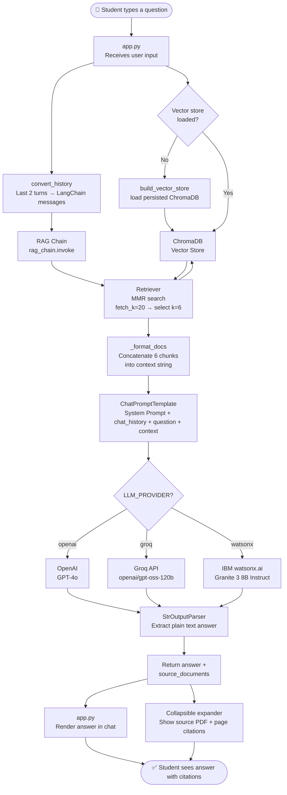
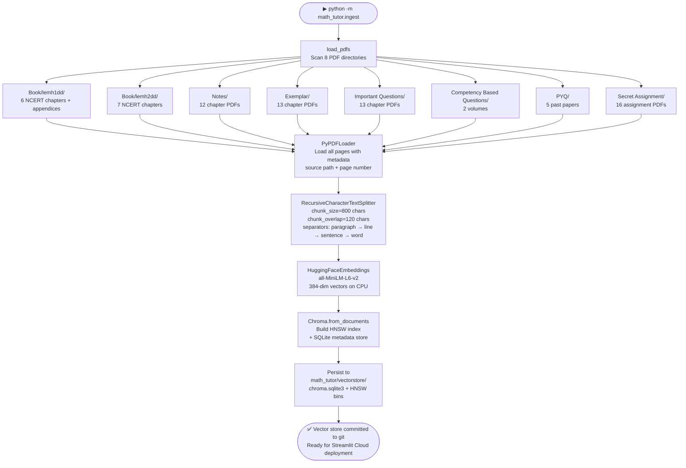
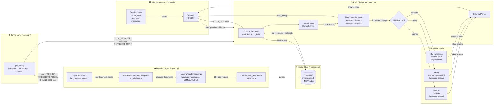

# Architecture — Maths RAG Project

**Class 12 CBSE Mathematics RAG Agent** — powered by NCERT notes, exemplar, important questions, PYQs, competency-based questions, and secret assignments. Designed for 2027 Board Exam preparation.

---

## Table of Contents

1. [Project Overview](#1-project-overview)
2. [High-Level Architecture](#2-high-level-architecture)
3. [Component Deep-Dive](#3-component-deep-dive)
4. [RAG Flow Diagram](#4-rag-flow-diagram)
5. [Ingestion Pipeline Flow](#5-ingestion-pipeline-flow)
6. [AI Tools & Libraries](#6-ai-tools--libraries)
7. [Tool Connection Map](#7-tool-connection-map)
8. [Data Sources](#8-data-sources)
9. [Configuration & Secrets](#9-configuration--secrets)
10. [Deployment](#10-deployment)

---

## 1. Project Overview

This project is a **Retrieval-Augmented Generation (RAG)** chatbot that acts as a Class 12 Math teacher. Instead of relying solely on an LLM's training knowledge, every answer is grounded in the student's own study material — NCERT textbooks, exemplar problems, CBSE notes, important questions, Previous Year Questions (PYQs), competency-based questions, and secret assignments — all stored as searchable PDF documents.

**Key capabilities:**
- Step-by-step CBSE-pattern answers (Sections A–E mark format)
- HOTS (Higher Order Thinking Skills) question generation
- Formulae recall and concept explanations anchored to NCERT chapters
- Source citation — every answer links back to the specific PDF page it was derived from
- Multi-turn chat with rolling conversation history
- Swappable LLM backend: **OpenAI GPT-4o**, **Groq**, or **IBM watsonx.ai (Granite)**

---

## 2. High-Level Architecture

```
┌──────────────────────────────────────────────────────────────────────────┐
│                        Maths RAG Agent                                   │
│                                                                          │
│  ┌──────────────┐     ┌───────────────┐     ┌──────────────────────┐    │
│  │  PDF Corpus  │────▶│  Ingest       │────▶│  ChromaDB            │    │
│  │  (Study      │     │  Pipeline     │     │  Vector Store        │    │
│  │   Material)  │     │  (ingest.py)  │     │  (vectorstore/)      │    │
│  └──────────────┘     └───────────────┘     └──────────┬───────────┘    │
│                                                         │                │
│                                                         │ similarity     │
│                                                         │ search (MMR)   │
│                                                         ▼                │
│  ┌──────────────┐     ┌───────────────┐     ┌──────────────────────┐    │
│  │  Streamlit   │────▶│  RAG Chain    │────▶│  LLM Backend         │    │
│  │  Chat UI     │◀────│  (rag_chain   │◀────│  OpenAI / Groq /     │    │
│  │  (app.py)    │     │  .py)         │     │  IBM watsonx.ai      │    │
│  └──────────────┘     └───────────────┘     └──────────────────────┘    │
└──────────────────────────────────────────────────────────────────────────┘
```

---

## 3. Component Deep-Dive

### `math_tutor/config.py` — Central Configuration

Resolves all runtime settings with a priority chain:

1. **`st.secrets`** — Streamlit Community Cloud secrets (production)
2. **`os.environ`** — local `.env` / shell exports (development)
3. **Hardcoded defaults** — safe fallback values

| Config Key | Default | Purpose |
|---|---|---|
| `LLM_PROVIDER` | `"openai"` | Selects the LLM backend |
| `EMBEDDING_MODEL` | `sentence-transformers/all-MiniLM-L6-v2` | HuggingFace embedding model |
| `RETRIEVER_TOP_K` | `6` | Number of chunks returned per query |
| `CHUNK_SIZE` | `800` | Characters per document chunk |
| `CHUNK_OVERLAP` | `120` | Overlap between consecutive chunks |

---

### `math_tutor/ingest.py` — PDF Ingestion Pipeline

Responsible for the **one-time** (or on-demand) construction of the vector store.

**Steps:**
1. **Load** — `PyPDFLoader` reads all PDFs across 8 configured directories
2. **Split** — `RecursiveCharacterTextSplitter` breaks pages into 800-char chunks with 120-char overlap
3. **Embed** — `HuggingFaceEmbeddings` converts each chunk to a 384-dim vector using `all-MiniLM-L6-v2` (runs on CPU)
4. **Persist** — `Chroma.from_documents()` writes all vectors + metadata to `math_tutor/vectorstore/`

The persisted vector store is committed to git so Streamlit Cloud can load it without re-running ingestion.

---

### `math_tutor/rag_chain.py` — RAG Chain

Builds a **LangChain LCEL** pipeline that wires retrieval → prompting → generation:

```
user question
     │
     ▼
 retriever.invoke(question)          ← MMR search over ChromaDB (top-6 chunks)
     │
     ▼
 _format_docs(chunks)                ← concatenate chunk text into {context}
     │
     ▼
 ChatPromptTemplate                  ← System prompt + chat_history + {question}
     │
     ▼
 LLM (OpenAI / Groq / watsonx)      ← generates the answer
     │
     ▼
 StrOutputParser                     ← extract plain string
     │
     ▼
 {"answer": str, "source_documents": list}
```

The retriever uses **MMR (Maximal Marginal Relevance)** — fetches `fetch_k=20` candidates, then selects `k=6` to maximise both relevance *and* diversity, avoiding repetitive context blocks.

---

### `math_tutor/app.py` — Streamlit Chat UI

The user-facing layer built on Streamlit:

- **Sidebar** — chapter navigation, PDF download links grouped by category, sample prompts, and a "Rebuild Vector Store" button
- **Session state** — caches `vector_store`, `rag_chain`, and `messages` across re-renders; avoids re-loading embeddings on every interaction
- **Chat loop** — appends messages to `st.session_state["messages"]`, sends last 4 messages (2 turns) as `chat_history` to the chain, then renders the LLM response with collapsible source citations
- **Error handling** — distinguishes Groq rate-limit (429 / RPM/TPM) from OpenAI quota errors and surfaces human-readable guidance

---

## 4. RAG Flow Diagram

This diagram shows the **query-time (inference) flow** — what happens every time a student sends a message.



---

## 5. Ingestion Pipeline Flow

This diagram shows the **build-time (offline) flow** — run once locally before deploying.



---

## 6. AI Tools & Libraries

### Core AI Components

| Tool / Library | Version | Role | Purpose |
|---|---|---|---|
| **LangChain** | `1.4.3` | Orchestration framework | Provides LCEL (LangChain Expression Language) pipeline primitives: `RunnablePassthrough`, `RunnableLambda`, `ChatPromptTemplate`, `StrOutputParser` |
| **LangChain Community** | `0.4.2` | Document loaders | Supplies `PyPDFLoader` to read PDF files page-by-page with metadata |
| **LangChain Chroma** | `1.1.0` | Vector store integration | Bridges LangChain retrieval API to ChromaDB; exposes `.as_retriever()` interface |
| **LangChain HuggingFace** | `1.2.2` | Embedding integration | Wraps `sentence-transformers` models in the LangChain `Embeddings` interface |
| **LangChain OpenAI** | `1.6.7` | LLM integration | Powers both **OpenAI** (`gpt-4o`) and **Groq** backends (Groq is OpenAI-API-compatible) |
| **LangChain IBM** | `1.1.1` | LLM integration | Connects to **IBM watsonx.ai** via `WatsonxLLM` |

### Embedding Model

| Tool | Version | Role | Purpose |
|---|---|---|---|
| **sentence-transformers** | `3.4.1` | Text embedding | Runs `all-MiniLM-L6-v2` locally on CPU to convert text chunks into 384-dimensional semantic vectors — no external API call needed |
| **HuggingFace Hub** | (transitive) | Model hosting | Source registry from which `all-MiniLM-L6-v2` is downloaded and cached at `SENTENCE_TRANSFORMERS_HOME=/tmp/st_cache` |

### Vector Database

| Tool | Version | Role | Purpose |
|---|---|---|---|
| **ChromaDB** | `1.5.9` | Vector store | Persists embedding vectors in an **HNSW (Hierarchical Navigable Small World)** index for approximate nearest-neighbour search. Stores metadata (source file, page number) in `chroma.sqlite3`. Supports **MMR retrieval** to balance relevance vs. diversity |

### LLM Backends (Configurable)

| Backend | Model | Provider | Purpose |
|---|---|---|---|
| **OpenAI GPT-4o** | `gpt-4o` | OpenAI API | Default LLM — state-of-the-art reasoning and mathematical explanation quality |
| **Groq** | `openai/gpt-oss-120b` | Groq API (OpenAI-compatible) | Free-tier alternative; ultra-fast inference via Groq's LPU hardware |
| **IBM watsonx.ai Granite** | `ibm/granite-3-8b-instruct` | IBM Cloud | Enterprise alternative; 8B instruction-tuned model on watsonx.ai platform |

### PDF Processing

| Tool | Version | Role | Purpose |
|---|---|---|---|
| **pypdf** | `5.4.0` | PDF parsing | Extracts raw text and page metadata from PDF files |
| **cryptography** | `>=50.0.0` | PDF decryption | Handles encrypted/password-protected PDFs via pypdf |

### UI Framework

| Tool | Version | Role | Purpose |
|---|---|---|---|
| **Streamlit** | `1.45.1` | Web UI framework | Provides the chat interface, session state management, sidebar, expandable source citations, and spinner feedback |

### Utilities

| Tool | Version | Role | Purpose |
|---|---|---|---|
| **python-dotenv** | `1.1.0` | Secret management | Loads `.env` file into `os.environ` for local development |

---

## 7. Tool Connection Map

This diagram shows **how all AI tools are wired together** at runtime, from student input to final answer.



---

## 8. Data Sources

All study material lives as PDFs in the repository root and is scanned by the ingestion pipeline:

| Directory | Content | Chapters |
|---|---|---|
| `Book/lemh1dd/` | NCERT Textbook Part 1 | Ch 1–6 + appendices + answers |
| `Book/lemh2dd/` | NCERT Textbook Part 2 | Ch 7–13 + answers |
| `Notes/` | CBSE chapter-wise notes | Ch 1–13 (12 PDFs) |
| `Exemplar/` | NCERT Exemplar Problems & Solutions | Ch 1–13 (13 PDFs) |
| `Important Questions/` | Curated important questions | Ch 1–13 (13 PDFs) |
| `Competency Based Questions/` | Competency-based question banks | Vol 1 & 2 |
| `PYQ/` | CBSE Board Past Year Question Papers | 2024–2025 (5 sets) |
| `Secret Assignment/` | Practice assignments (Day-wise) | 16 PDFs |

---

## 9. Configuration & Secrets

All secrets are injected at runtime and **never hardcoded**. See [`.streamlit/secrets.toml.example`](.streamlit/secrets.toml.example) for the full template.

| Secret Key | Required For | Example |
|---|---|---|
| `LLM_PROVIDER` | All | `"openai"` / `"groq"` / `"watsonx"` |
| `OPENAI_API_KEY` | OpenAI backend | `"sk-..."` |
| `OPENAI_MODEL` | OpenAI backend | `"gpt-4o"` |
| `GROQ_API_KEY` | Groq backend | `"gsk_..."` |
| `GROQ_MODEL` | Groq backend | `"openai/gpt-oss-120b"` |
| `WATSONX_API_KEY` | watsonx.ai backend | `"..."` |
| `WATSONX_PROJECT_ID` | watsonx.ai backend | `"..."` |
| `WATSONX_URL` | watsonx.ai backend | `"https://us-south.ml.cloud.ibm.com"` |
| `WATSONX_MODEL` | watsonx.ai backend | `"ibm/granite-3-8b-instruct"` |
| `RETRIEVER_TOP_K` | Retrieval tuning | `"6"` |
| `CHUNK_SIZE` | Ingestion tuning | `"800"` |
| `CHUNK_OVERLAP` | Ingestion tuning | `"120"` |

**Resolution order (config.py):**
```
st.secrets  ──▶  os.environ  ──▶  hardcoded default
```

---

## 10. Deployment

### Local Development

```bash
# 1. Install dependencies
pip install -r requirements.txt

# 2. Configure secrets
cp .streamlit/secrets.toml.example .streamlit/secrets.toml
# Edit secrets.toml — add your API key

# 3. Build vector store (one-time; commits vectorstore/ to git)
python -m math_tutor.ingest

# 4. Run the app
streamlit run math_tutor/app.py
```

### Streamlit Community Cloud

1. Push the repo (including the pre-built `math_tutor/vectorstore/`) to GitHub
2. Connect repo at [share.streamlit.io](https://share.streamlit.io)
3. Set **Main file path** → `math_tutor/app.py`
4. Add secrets via **Settings → Secrets** (use `secrets.toml.example` as template)
5. Deploy — the vectorstore is loaded directly from git; no re-ingestion needed

### Vector Store Strategy

| Environment | Approach |
|---|---|
| Local dev | Run `python -m math_tutor.ingest` to build/rebuild |
| Streamlit Cloud | Pre-built `vectorstore/` committed to git and loaded on startup |
| Force rebuild | Click "🔄 Rebuild Vector Store" button in sidebar, or pass `force_rebuild=True` |
